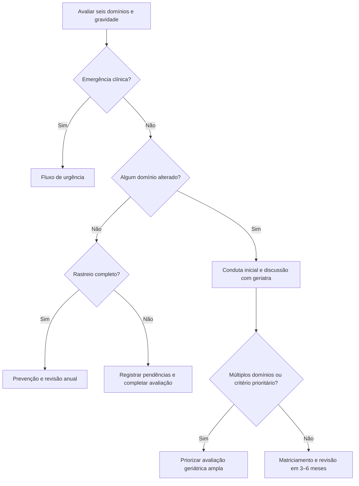

# Projeto Saúde da Família

Especificação funcional e técnica autorizada pela product owner, Dra. Natalia Mendes, para o módulo de cuidado da pessoa idosa na medicina de família.

[Baixar o relatório completo em Word](./projeto-saude-da-familia.docx)

Versão 1.3 — 8 de outubro de 2026.

## Escopo aprovado

- Cognição: 10-CS; aprofundamento com MEEM quando indicado; FAST em demência já diagnosticada.
- Funcionalidade: Katz e Lawton; humor: GDS-5.
- Locomoção: cinco levantadas, apoio à deambulação e SARC-CalF.
- Fragilidade: FRAIL-BR; nutrição: MNA-SF.
- Quedas e revisão medicamentosa: STOPPFall, sem escore global inventado ou suspensão automática de medicamentos.
- Disfagia quando houver queixa; PPS quando houver indicação de cuidados paliativos.
- Visão, audição, cinco ou mais doenças crônicas e uso diário de cinco ou mais medicamentos.
- Internação nos últimos seis meses: abrir LACE com episódio e data da alta identificados.

## Informações técnicas no relatório final

Exibir botão próximo à tabela de resultados. Ao clicar, abrir seção expansível no contexto do paciente e da consulta, acessível por teclado, sem perder a posição de leitura. Mostrar data, versão dos instrumentos, domínios alterados e pendências. Organizar em rastreio inicial, interpretação por domínio, discussão com o geriatra e plano compartilhado.

Aplicar os seis domínios na consulta índice ou no exame periódico; repetir anualmente quando não houver alterações e antecipar conforme necessidade clínica. GDS-5 permanece padrão; GDS-15 é alternativa identificada, sem exigir ambas. Não tratar testes cognitivos ou motores como autoaplicáveis.

| Domínio | Critério do programa | Orientação inicial |
| --- | --- | --- |
| Funcionalidade | Katz ou Lawton: qualquer item com necessidade de ajuda ou incapacidade | Investigar doença aguda, dor, déficit sensorial e medicamentos; registrar evolução; terapia ocupacional/fisioterapia conforme necessidade. |
| Locomoção | 5xSTS >15 s, dispositivo de marcha ou queda no último ano | Revisar medicamentos com STOPPFall, visão, calçados e ambiente; avaliar marcha/equilíbrio e encaminhar à fisioterapia. Incapacidade de realizar o teste exige avaliação, sem inventar tempo. |
| Humor | GDS-5 ≥2; GDS-15 ≥5 quando utilizada | Avaliar depressão, ideação suicida e álcool. GDS-15 ≥10 pede avaliação prioritária da intensidade e repercussão; sintomas graves, risco de suicídio ou falha terapêutica indicam saúde mental/psiquiatria. |
| Cognição | 10-CS ≤7: 6–7 possível comprometimento; ≤5 provável | MEEM e avaliação clínica com história, funcionalidade e relato familiar; investigar causas reversíveis conforme contexto. ≥8 não exclui suspeita persistente. Demência diagnosticada segue FAST. |
| Fragilidade | FRAIL 1–2: pré-fragilidade; ≥3: fragilidade | Rever polifarmácia e otimizar exercício/nutrição. Pré-fragilidade também exige discussão; revisão específica em 6–12 meses, antecipada se necessário. ≥3 prioriza avaliação geriátrica ampla. |
| Nutrição | MNA-SF ≤11 ou perda involuntária >3 kg em três meses | MNA-SF 8–11: risco; 0–7: desnutrição. Nutrição/dietética e investigação de disfagia, condições odontológicas, depressão, isolamento e acesso à alimentação. Queixa de disfagia abre EAT-10. |

GDS positiva não confirma diagnóstico ou gravidade de depressão. MEEM alterado não confirma demência sozinho. Congelar versão, ajustes por escolaridade e tradução dos instrumentos antes de codificar. O alerta independente de perda de peso não se transforma em escore MNA-SF.

### Regra única de discussão com o geriatra

**Qualquer domínio alterado exige discussão com o geriatra do programa, mesmo quando a conduta inicial já foi iniciada.** Matriciamento pode ser discussão de caso sem consulta presencial.

- Alteração isolada: condução pela equipe de família, matriciamento e reavaliação em 3–6 meses, ajustada à necessidade clínica.
- Dois ou mais domínios alterados, FRAIL ≥3, declínio funcional agudo/progressivo ou suspeita de demência reforçada em avaliação de segundo nível: priorizar avaliação geriátrica ampla e seguimento compartilhado.
- Seis domínios completos sem alteração: prevenção e revisão anual; discussão não obrigatória pelo protocolo.
- Emergência: fluxo de urgência independente. Avaliar imediatamente o risco diante de ideação suicida; risco iminente, lesão relevante após queda, instabilidade clínica ou repercussões graves da desnutrição seguem atendimento adequado sem aguardar matriciamento.

## Orientação para engenharia e aceite

Preservar respostas e resultados por paciente e consulta; abrir reaplicações em branco; manter subestágios FAST como texto, por exemplo 7E; comparar apenas aplicações realizadas e compatíveis.

Gerar orientações a partir de regras clínicas versionadas fora dos componentes React. Contar domínios distintos: Katz e Lawton alterados contam uma alteração funcional. FRAIL 1–2 ativa matriciamento; ≥3 também ativa prioridade. Uma alteração válida continua indicando discussão mesmo que outro domínio esteja incompleto.

Ausência de dados não equivale a zero ou normalidade. Somente avaliações completas sem alterações permitem a recomendação anual sem discussão obrigatória. Distinguir resultados atuais de históricos.

Persistir indicação, motivo, prioridade, estado pendente/discutido/encaminhado, responsável, data, participantes, plano acordado e prazo de seguimento. A sugestão só se torna conduta após confirmação médica. Abrir o painel ou finalizar a consulta não confirma encaminhamento nem discussão realizada.

No relatório familiar, usar linguagem acessível e condutas confirmadas; incluir apêndice técnico apenas por escolha explícita e após revisão. Preservar a tabela aprovada de resultados.

Homologar: nenhum domínio alterado; alteração isolada com conduta iniciada; dois instrumentos do mesmo domínio; múltiplos domínios; FRAIL 1–2/≥3; limiares GDS, 5xSTS, 10-CS e MNA-SF; demência diagnosticada; peso como alerta independente; dados ausentes/históricos; urgência e exportação familiar. O Word contém a matriz completa de aceite e referências clínicas.

Esta entrega é documentação de planejamento para implementação pela engenharia.
